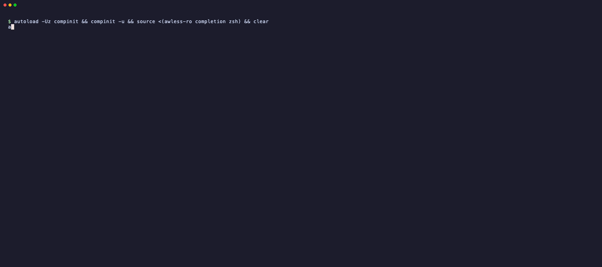

# awless-ro

A command line tool for **looking at** an AWS account: readable tables instead of
JSON, resources by name instead of by id, how they relate to each other, and output
you can pipe. Optionally, a local copy of the account to explore offline.

It cannot change anything. Not by convention: every AWS operation it is capable of
calling is a `Describe`, `Get`, `List` or `Head`, and a test enforces that.



## Why this exists

[`wallix/awless`](https://github.com/wallix/awless) was a genuinely good CLI, and it
has been unmaintained since 2018. It no longer builds: `dep` instead of modules, an
old Go, AWS SDK v1, and a vendor directory full of libraries that have since moved
on or been abandoned.

Its two halves aged very differently.

The **write** half — a templating language, hundreds of `create`/`delete`
one-liners, a log, `revert`, a scheduler — is the part you least want to run
unmaintained against a live account. Six years of AWS API drift sits between that
code and reality, and the failure mode is not a wrong listing, it is a wrong change.
It was also most of the maintenance burden.

The **read** half aged well, and still has no close equivalent. `aws ec2
describe-instances` gives you JSON about instances; it does not give you a graph
where an instance knows its subnet, its VPC, its security groups and what those
apply to, queryable offline. Nor does it let you say `show my-database` instead of
pasting an identifier.

So this fork keeps the read half, modernises it, and makes read-only a property of
the tool rather than a promise in a README.

That turns out to be the interesting part. A tool that provably cannot write is one
you can point at production, hand to someone new, or run in an account you are
nervous about — and the guarantee does not depend on how carefully you typed.

## What it is good for

Looking up what is in an AWS account from the terminal, instead of clicking through
the console: what runs where, how it is configured, and what it is connected to. It
uses the AWS profiles you already have.

It works in two ways:

- **Straight from the AWS API.** `list`, `search`, `whoami` and `tail` ask AWS each
  time, so the answer is current.
- **From a synced local copy.** `show` and `inspect` work on a graph of the account,
  which is where the extra information comes from: which subnet and VPC an instance
  is in, what a security group applies to, what depends on what. They refresh the copy
  themselves before answering; `awless-ro sync` fetches the whole account at once.

`list`, `show` and `inspect` also take `--local`: they then answer from the local copy
as it is, without calling AWS — instantly, and offline.

**"What is running here, and since when?"** A table you can read, sorted and filtered,
instead of a page of `describe-instances` JSON.

```sh
awless-ro list instances --sort uptime
awless-ro list instances --columns name,state,type,lifecycle,uptime   # which are spot
awless-ro list instances --filter state=running --filter type=t3
awless-ro list instances --tag Env=Production,Team=Payments
awless-ro list databases -r eu-west-1
```

**"What is this thing, and what is it connected to?"** Ask by name. An instance comes
with its subnet and VPC, its security groups and key pair, and the volumes attached to
it; a security group with everything it applies to; a user with their groups and
policies.

```sh
awless-ro show web-1
awless-ro show i-0123456789abcdef0
awless-ro show jsmith
awless-ro show sg-0a1b2c3d --siblings
```

**"Is anything left lying around?"** Detached volumes, old snapshots, access keys
nobody rotated, elastic IPs attached to nothing.

```sh
awless-ro list volumes --filter state=available
awless-ro list snapshots --sort created
awless-ro list accesskeys --sort created
awless-ro list elasticips
```

**"What is exposed?"** Every security group with the ports it opens and what it is
attached to; buckets readable by anyone, or by anyone with an AWS account.

```sh
awless-ro inspect -i port_scanner
awless-ro inspect -i open_buckets
```

**"Which AMI should I use?"** The current official image for a distribution in this
region, from the vendor's own account — not from whoever named an image
`ubuntu-latest`.

```sh
awless-ro search images canonical:ubuntu:noble --latest-id
awless-ro search images debian:::arm64
awless-ro search images amazonlinux
```

**"Who am I in this account?"** Before doing anything, check which identity, account
and policies the current profile resolves to.

```sh
awless-ro whoami
awless-ro whoami --account-only
```

**"What is this stack doing right now?"** Follow CloudFormation events or
autoscaling activity as they happen.

```sh
awless-ro tail stack-events my-stack --follow
awless-ro tail scaling-activities --follow
```

**Scripts and spreadsheets.** Every listing can be CSV, TSV, JSON or bare ids, and
`show` can print a single value.

```sh
awless-ro list users --format csv > users.csv
awless-ro list instances --filter state=stopped --ids
ssh ec2-user@$(awless-ro show web-1 --values-for privateip)
```

**Offline, or on a slow link.** Sync once, and `list`, `show` and `inspect` answer
instantly from the local copy with `--local`, without an AWS call — on a plane,
behind a VPN that keeps dropping, or when you want to go through an account at your
own pace.

```sh
awless-ro sync
awless-ro list instances --local
awless-ro show web-1 --local
```

**Several accounts and regions.** Your `~/.aws` profiles work as they are; switch
once, or override a single command.

```sh
awless-ro switch staging eu-west-1
awless-ro list instances -p production -r us-east-1
```

**Handing someone a tool.** Read-only is a property of the binary (see
[Security checks](#security-checks)), so it is a safe thing to give a new teammate, an
auditor, or an on-call engineer who needs to look around production at 3 am.

## Security checks

**In place now**

- *Read-only by construction.* Every AWS call goes through a narrow per-service
  interface and nothing else in the tree holds an SDK client, so the methods on those
  interfaces are the complete list of operations the binary can perform — currently 61
  across 18 services. `TestEveryAWSOperationIsARead` reflects over them and fails the
  build if any name is not a `Describe`, `Get`, `List` or `Head`, or if a field is a
  concrete client rather than an interface. Reflecting over the struct rather than a
  hand-written list means a service added later is covered without anyone remembering
  to.
- *No third-party egress.* The binary talks to AWS and nothing else. The upstream
  `pricer` inspector, which posted an EC2 inventory to an external host, is gone; the
  public-IP lookup in `whoami` uses HTTPS.
- *Secrets stay put.* `show` does not print instance `UserData`; secrets are read
  without echo and never logged; state under `~/.awless-ro` is `0700`, files in it
  `0600`, and nothing executable is written to a shared directory.
- *Audited SSH and key handling.* The shared-`/tmp` script behind `ProxyCommand` was
  removed, deprecated unauthenticated PEM decryption replaced, key files with loose
  permissions refused, and key names from AWS data can no longer escape the keys
  directory.
- *AMI search pinned to publishing accounts,* so a look-alike image name cannot be
  substituted ([whoAMI](https://securitylabs.datadoghq.com/articles/whoami-a-cloud-image-name-confusion-attack/)).
- *CI on every push and pull request:* `gofmt`, `go vet`, `go test -race`,
  `go mod verify` against `go.sum`, `govulncheck` for known vulnerabilities in
  reachable code, and a check that generated code matches its definitions.
- *Dependency review on pull requests,* blocking a new dependency that arrives with a
  known advisory or a copyleft licence. `govulncheck` answers a different question —
  whether vulnerable code is reachable — and misses a bad dependency nothing calls yet.
- *A weekly scan independent of any commit,* because an advisory published after the
  last push would otherwise go unnoticed for as long as the repository is quiet.
- *Releases built by GitHub Actions from the tag,* not on a workstation, re-running the
  test and vulnerability gates first — a tag can be pushed to a commit that never
  passed CI — and verifying the published checksums against the published files.
- *Supply chain:* GitHub Actions pinned by commit SHA, workflow token read-only,
  Dependabot updates for Go modules and actions, GitHub secret scanning with push
  protection, Dependabot security updates, and a `SHA256SUMS` file with every release.

- *The workflows are linted,* because they are the only code here with no compiler
  and no tests, and they are what holds the SHA pins and the least-privilege tokens.

**Planned, to run automatically**

- Static analysis (CodeQL) on every pull request.
- `zizmor` to audit the workflows for template injection and over-broad permissions,
  which linting does not look for.
- OpenSSF Scorecard for the repository's own security posture.
- Build provenance attestations and an SBOM attached to every release.

Found something exploitable? Please report it through
[Security → Report a vulnerability](https://github.com/theazz/awless-ro/security/advisories/new),
which is private between you and the maintainer, rather than in a public issue.

## Install

With [Homebrew](https://brew.sh), on macOS or Linux:

```sh
brew install theazz/tap/awless-ro
```

The formula installs the binary published with each release, checked against its
SHA-256, and shell completion. Upgrade with `brew upgrade awless-ro`.

With Go:

```sh
go install github.com/theazz/awless-ro@latest
```

Or download a binary from
[releases](https://github.com/theazz/awless-ro/releases) and verify it:

```sh
shasum -a 256 -c SHA256SUMS --ignore-missing
```

Or build from source:

```sh
git clone https://github.com/theazz/awless-ro && cd awless-ro
go build -o awless-ro .
```

Requires Go 1.26. No configuration needed if you already use the AWS CLI: existing
`~/.aws/{credentials,config}` profiles are picked up, and anything missing is
prompted for on first run. With no profile chosen, credentials in
`AWS_ACCESS_KEY_ID` and `AWS_SECRET_ACCESS_KEY` are used, as are container and
instance roles — the AWS SDK's own order — so nothing needs configuring in CI.

State lives in `~/.awless-ro` — deliberately not `~/.awless`, so an installed
upstream `awless` and this tool cannot overwrite each other's graph, database or
keys.

### Shell completion

**Installed with Homebrew**, the completion files are already in place:

- **fish** picks them up on its own.
- **zsh** and **bash** read them only if the shell is set up for Homebrew's
  completions, once per machine. If Tab already completes `brew` itself, it is;
  otherwise follow [Homebrew's shell completion guide](https://docs.brew.sh/Shell-Completion)
  (for zsh, a few lines in `~/.zshrc`; for bash, the `bash-completion@2` package).

Open a new shell afterwards.

**Installed any other way**, add it to your shell yourself:

```sh
# bash (needs the bash-completion package; eval rather than source <(...),
# which the bash 3.2 shipped with macOS does not support)
echo 'eval "$(awless-ro completion bash)"' >> ~/.bashrc

# zsh
awless-ro completion zsh > "${fpath[1]}/_awless-ro"

# fish
awless-ro completion fish > ~/.config/fish/completions/awless-ro.fish
```

Completion covers commands and flags, regions and profiles, config keys and their
values, and — from the local copy, once you have synced — resource ids and names
for `show`. It never calls AWS: a Tab press does not wait on the network.

## Commands

**`list`** — 49 resource types across EC2, IAM, S3, RDS, AutoScaling, SNS, SQS,
Route53, CloudWatch, CloudFormation, Lambda, ECS, ECR, ELB, CloudFront and ACM,
fetched from AWS when you ask (`awless-ro list -h` shows them all; `ls` is an alias).

```sh
awless-ro list instances --filter state=running --sort uptime
awless-ro list instances --columns name,state,architecture,lifecycle
awless-ro list volumes --tag-key Dept --format tsv
awless-ro list users --format json
```

`--filter` matches any column, case-insensitively, in one of two forms:

| Form | Matches | Example |
|---|---|---|
| `key=value` | any column containing the value | `--filter type=t3` finds `t3.micro` and `t3.large` |
| `key==value` | the whole column value | `--filter state==Active` finds `Active` and not `Inactive` |

The substring form cannot exclude a longer value that contains the one you asked
for, which is what the exact form is for:

```sh
awless-ro list accesskeys --filter state==Active   # only the active keys
awless-ro list accesskeys --filter state=active    # also the Inactive ones: "inactive" contains "active"
```

Both forms compare the value as it is stored rather than the cell as it is
printed, so a date column is matched on its full timestamp and not on the `2
days` the table shows.

`--tag`, `--tag-key` and `--tag-value` match tags. `--columns` reaches any property a
resource carries, not only the default columns. `--format` covers `table`, `csv`, `tsv`,
`json` and `porcelain`; `--ids` prints one id per line and nothing else, for scripts.
`-r` and `-p` override the region and profile for one command.

`--tag`, `--tag-key` and `--tag-value` take several values separated by commas
(`--tag Env=Production,Team=Payments`), so a value that itself contains a comma is
quoted twice: double quotes for awless-ro, single quotes around them for the shell
(bash, zsh and fish alike).

```sh
awless-ro list instances --tag '"Environment=Not, tagged"'
awless-ro list instances --tag-value '"Not, tagged"'
```

Without them, `--tag 'Environment=Not, tagged'` is read as two tags and refused, and
a backslash does not escape the comma.

**`show`** — one resource by id, by name, or by `@name`, with its relations. Names
are not unique in AWS, so an ambiguous one lists the candidates.

```sh
awless-ro show i-0123456789abcdef0
awless-ro show my-database
awless-ro show web-1 --values-for publicip,keypair
```

Output is the resource's properties, then its lineage (parents and children), then
what it applies to, depends on, and its siblings.

**`search images`** — official AMIs by vendor, pinned to the publishing account,
resolving to the vendor's ordinary image rather than a specialised build.

```sh
awless-ro search images canonical --latest-id
awless-ro search images redhat::9
awless-ro search images --owner 123456789012 --name 'my-base-*'
```

**`inspect` and `tail`.**

```sh
awless-ro inspect -i port_scanner     # security groups opening ports, and to what
awless-ro inspect -i open_buckets
awless-ro inspect -i bucket_sizer
awless-ro tail stack-events my-stack --follow
```

**`whoami`** and **`switch`** — the identity behind the current profile, and a
persistent change of region or profile.

```sh
awless-ro whoami
awless-ro switch eu-west-1
awless-ro switch my-profile eu-west-1
```

**Aliases.** Reference a resource by its `Name` tag anywhere an id is accepted.

### Offline mode (optional)

`awless-ro sync` fetches every supported service in parallel and stores the result
as a local graph under `~/.awless-ro`. After that, `list`, `show` and `inspect` with `--local` answer
from that copy without calling AWS. A service you lack permission for is reported
and skipped; the rest still land.

```
-> infra: 12 instances, 2 vpcs, 9 securitygroups, 14 networkinterfaces, ...
-> access: 5 users, 40 roles, 61 policies, 4 instanceprofiles, ...
-> storage: 7 buckets, s3objects: off (aws.storage.s3object.sync)
```

Two resource types are off by default because they cost an API call per parent — one
per bucket, one per hosted zone. The sync says so rather than reporting zero of them.

You rarely need to run it by hand. `show` and `inspect` refresh the copy on their own
for the services they touch, and changing region with `switch` syncs the new one
once. The first run does not sync. `--no-sync` skips that for one command, and
`awless-ro config set autosync false` turns it off for good.

## What was removed

Gone, and not coming back:

- the templating language and `.aws` template files
- every `create`, `update`, `delete`, `attach`, `detach`, `start`, `stop` command
- `awless log` and `awless revert`
- the scheduler integration (`wallix/awless-scheduler`)
- `awless web` and the embedded HTTP server
- the `pricer` inspector, which posted an inventory of your EC2 instances to a
  third-party host whose domain **was not registered** when this fork was made

Not yet working:

- **`awless-ro ssh`**. The resolution and connection logic is there and mostly
  works, but `--local` panics, `--print-cli` connects instead of printing, and the
  host key prompt loops when there is no terminal. The command explains this instead
  of running. Tracked in [#1](https://github.com/theazz/awless-ro/issues/1).

## Differences you will notice if you used awless

- Binary and state directory are `awless-ro` / `~/.awless-ro`.
- Version restarts at `v0.1.0`. Continuing upstream's `v0.1.11` would imply a
  compatibility that does not exist.
- Failures exit non-zero. Upstream discarded the error from the root command, so
  everything exited 0.
- `--ids` prints ids only. It used to print each resource's name as well, on its own
  line, which a script cannot tell apart from an id.
- AMI vendor `coreos` and `centos` are gone: CoreOS Container Linux reached end of
  life in 2020, and the account publishing CentOS Stream images could not be verified
  from a source belonging to the project or to AWS. Shipping an unverified account id
  is the mistake the [whoAMI attack](https://securitylabs.datadoghq.com/articles/whoami-a-cloud-image-name-confusion-attack/)
  relies on.

The full accounting is in [CHANGELOG.md](CHANGELOG.md).

## Status and caveats

The tool is checked against live AWS accounts, which is where the defects that matter
turn up: unit tests verify that the code does what it was meant to, and the live
checks verify that what it was meant to do matches how AWS actually behaves. Nine
defects were found that way, and none of them was visible to a test. If you point it
at your account and something looks wrong, that finding is useful: please open an
issue.

`go test ./... -race` is green and no test needs AWS credentials.

## Versioning

Releases follow [Semantic Versioning 2.0.0](https://semver.org/) and are tagged
`vMAJOR.MINOR.PATCH`. The public API is the command line: commands, flags, output
formats (`csv`, `tsv`, `json`, `porcelain`, `--ids`) and exit codes.

- **PATCH** — bug fixes that do not change documented behaviour.
- **MINOR** — new commands, flags, resource types or services, backwards compatible.
- **MAJOR** — anything that breaks a documented command, flag or output format.

While the version is `0.y.z`, a breaking change bumps the **minor** version instead,
as SemVer allows. Every release has an entry in [CHANGELOG.md](CHANGELOG.md).

## Contributing

Feature requests and pull requests with improvements are very welcome — open an
[issue](https://github.com/theazz/awless-ro/issues) to suggest something or to
discuss a change before writing it. Bugs get fixed as time allows, on a best-effort
basis. The one thing that will not be accepted is anything that makes the tool
write: see the scope section in CONTRIBUTING.

[CONTRIBUTING.md](CONTRIBUTING.md) covers the layout, how code generation works, and
the supply-chain rules for dependencies.

## Licence and provenance

Apache 2.0, inherited from `wallix/awless` — copyright and licence retained, see
[NOTICE](NOTICE). This is a fork of
[wallix/awless](https://github.com/wallix/awless) at commit `44e892b4`, and its
history is preserved in full in this repository.
